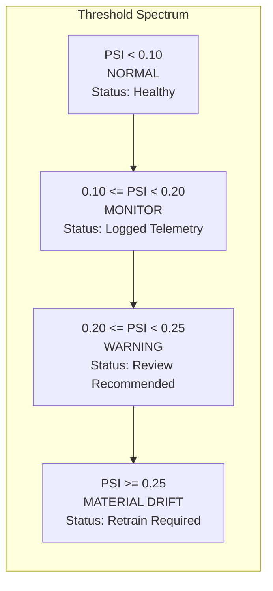

# Phase 11 — Continuous Drift Monitoring & Distribution Shift Governance

## 1. Overview & Principles

Continuous model validity requires active, real-time monitoring of feature distributions, prediction likelihoods, and calibration reliability. Models in production do not degrade instantaneously; they experience subtle shifts due to tactical meta changes, player transfer turnover, provider payload updates, or refereeing rule interpretations.

---

## 2. Population Stability Index (PSI) Governance (§17)

The `ContinuousDriftMonitor` (`app/phase11/drift_monitoring.py`) calculates the empirical Population Stability Index (PSI) across baseline reference distributions $P$ and current evaluation windows $Q$:

$$\text{PSI} = \sum_{b=1}^B \left( q_b - p_b \right) \times \ln\left( \frac{q_b + \epsilon}{p_b + \epsilon} \right)$$

where $B=10$ quantile bins, and $\epsilon = 10^{-6}$ provides numerical stability.

### Governed PSI Action Thresholds

| Range | Drift Status | Governance Action | Model Authority |
|:---:|:---:|:---|:---:|
| $\text{PSI} < 0.10$ | `NORMAL` | Standard operational logging | Full Authoritative |
| $0.10 \le \text{PSI} < 0.20$ | `MONITOR` | Increase telemetry sampling; flag in operational dashboard | Full Authoritative |
| $0.20 \le \text{PSI} < 0.25$ | `WARNING` | Emit `MODEL_DRIFT_DETECTED` alert; trigger engineer notification | Authoritative with Warning Badge |
| $\text{PSI} \ge 0.25$ | `MATERIAL_DRIFT` | Emit `MODEL_RETRAIN_REQUIRED` alert; automatically flag model as `REVIEW_REQUIRED` | Demote to `DEGRADED`; block automated recruitment bids |

---

## 3. Comprehensive Telemetry Tracking

The drift engine monitors six orthogonal drift dimensions simultaneously:
1. **Feature Distribution Drift (PSI)**: Detects shifting pitch metrics (e.g. dramatic rise in high-turnover counters).
2. **Prediction Distribution Drift**: Detects changes in predicted outcome frequencies (Home Win / Draw / Away Win).
3. **Brier Score Drift**: Detects out-of-sample probability accuracy degradation ($\Delta \text{Brier} > 0.05$).
4. **Log Loss Drift**: Detects tail probability overconfidence ($\Delta \text{LogLoss} > 0.10$).
5. **Expected Calibration Error (ECE) Drift**: Detects probability miscalibration ($\Delta \text{ECE} > 0.04$).
6. **Missingness & Schema Drift**: Detects sudden provider coverage drops ($\Delta \text{Missingness} > 0.02$).

---

## 4. Factual, Non-Causal Alerting Engine (§27)

All system-generated alerts conform strictly to the **Non-Causal Policy**:
- **Permitted (Factual Telemetry)**:  
  `"MODEL_DRIFT_DETECTED: Model 'bundesliga_logit_candidate_v1' exhibited feature PSI of 0.218 exceeding warning threshold (0.20)."`
- **Prohibited (Unverified Causal Attribution)**:  
  `"Model is failing because Bayern Munich changed their tactical formation and strikers are underperforming."`

Alerts are stored immutably and accessible via `GET /api/phase11/drift/{competition_id}` and the frontend Global Operations dashboard.
