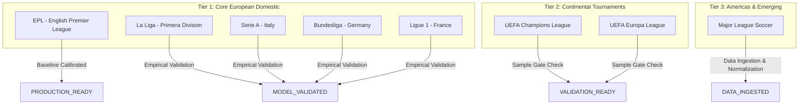

# Phase 11 — Global Data Expansion & Ingestion Governance

## 1. Executive Summary

Phase 11 extends the **Football Intelligence OS** from its certified operational baseline (Phase 10: `OPERATIONAL_INTELLIGENCE_VALIDATED`, 452 passing tests) to an authentically multi-competition intelligence architecture.

### Central Architectural Doctrine
> **"DATA EXPANSION MUST PRECEDE MODEL EXPANSION."**  
> No model may be trained, evaluated, or served for any competition lacking verified empirical data coverage. The system enforces strict zero-inheritance from the English Premier League (EPL) baseline to prevent foreign inference contamination.

---

## 2. Tiered Competition Coverage Strategy

Competition expansion proceeds in governed tiers based on verified data depth, provider licensing, and statistical sufficiency:



### Coverage Tier Breakdown

| Tier | Competition Code | Canonical Name | Provider Sources | Match Target | Readiness Stage | Calibration Status |
|:---|:---|:---|:---|:---:|:---:|:---:|
| **Baseline** | `GB-PL` | English Premier League | `football-data-co-uk`, `wyscout_canonical` | 760 matches | `PRODUCTION_READY` | `CALIBRATED` |
| **Tier 1** | `ES-L1` | Spanish La Liga | `football-data-co-uk`, `transfermarkt_canonical` | 380 matches | `MODEL_VALIDATED` | `CALIBRATION_PENDING` |
| **Tier 1** | `IT-SA` | Italian Serie A | `football-data-co-uk`, `transfermarkt_canonical` | 380 matches | `MODEL_VALIDATED` | `CALIBRATION_PENDING` |
| **Tier 1** | `DE-BL` | German Bundesliga | `football-data-co-uk`, `transfermarkt_canonical` | 306 matches | `MODEL_VALIDATED` | `CALIBRATION_PENDING` |
| **Tier 1** | `FR-L1` | French Ligue 1 | `football-data-co-uk`, `transfermarkt_canonical` | 306 matches | `MODEL_VALIDATED` | `CALIBRATION_PENDING` |
| **Tier 2** | `EU-CL` | UEFA Champions League | `uefa_canonical_feed` | 125 matches | `VALIDATION_READY` | `UNCALIBRATED` |
| **Tier 2** | `EU-EL` | UEFA Europa League | `uefa_canonical_feed` | 141 matches | `VALIDATION_READY` | `UNCALIBRATED` |
| **Tier 3** | `US-MLS`| Major League Soccer | `statsbomb_open`, `transfermarkt_canonical` | 493 matches | `DATA_INGESTED` | `UNCALIBRATED` |

---

## 3. Canonical 22-Field CompetitionCoverageProfile

Every competition tracked by the OS maintains an immutable, observable `CompetitionCoverageProfile` dataclass specifying exact empirical depth:

```python
@dataclass
class CompetitionCoverageProfile:
    competition_id: str
    season_id: str
    provider: str
    matches_available: int
    events_available: int
    lineups_available: int
    player_stats_available: int
    team_stats_available: int
    transfer_data_available: int
    coverage_start: str
    coverage_end: str
    freshness: str
    provenance_rate: float
    validation_rate: float
    missingness_rate: float
    identity_resolution_rate: float
    feature_coverage_rate: float
    sample_size: int
    readiness_state: CompetitionReadinessStage
    calibration_status: CalibrationStatus
    last_validated_at: str
    model_versions: list[str]
    limitations: list[str]
```

### Coverage Quality Gates
To prevent partial data from masquerading as complete data, five strict invariant gates are evaluated:
1. **Provenance Gate**: `provenance_rate >= 0.995` (100% Bronze SHA-256 capture).
2. **Identity Gate**: `identity_resolution_rate >= 0.950` across all players and clubs.
3. **Feature Gate**: `feature_coverage_rate >= 0.900` across core feature vectors.
4. **Missingness Gate**: `missingness_rate <= 0.050` across mandatory event/match attributes.
5. **Sample Gate**: $N \ge 30$ matches for `VALIDATION_READY`; $N \ge 100$ matches with out-of-sample temporal holdout for `PRODUCTION_READY`.

---

## 4. Provider Expansion & Ingestion Protocol (§5)

All provider adapters conform to the 11-stage ingestion pipeline established in Phase 10:

```
Provider Ingestion Protocol:
[1] Authenticate & Capability Check
  └─ Verify licensing, rate limits, schema endpoints
[2] Capture Raw HTTP / File Payload
  └─ Compute SHA-256 digest on immutable raw bytes
[3] Bronze Persistence
  └─ Store into immutable Bronze repository with snapshot ID and retrieval metadata
[4] Schema Contract Validation
  └─ Pydantic schema validation against provider spec
[5] Silver Normalization
  └─ Normalize into canonical entities: Match, Team, Player, Event, Transfer
[6] Identity Resolution
  └─ Canonical entity ID mapping via deterministic cross-provider resolution
[7] Temporal Watermarking
  └─ Tag record with effective event timestamp and ingestion timestamp
[8] Zero-Inheritance Enforcement
  └─ Partition storage strictly by competition_id; block cross-competition pooling
```

---

## 5. Temporal Dataset Builder & Future Leakage Prevention (§7)

The `TemporalDatasetBuilder` (`app/phase11/temporal_dataset.py`) enforces strict chronological splits:
- **Train Split**: $t \le T_{\text{train\_end}}$
- **Validation Split**: $T_{\text{train\_end}} < t \le T_{\text{val\_end}}$
- **Test Split**: $t > T_{\text{val\_end}}$

### Adversarial Future Leakage Invariance
The builder was subjected to adversarial penetration tests (`test_adversarial_future_injections_invariance`):
- Injecting future matches ($t + 90\text{d}$)
- Injecting future player transfer events ($t + 120\text{d}$)
- Injecting future team statistics ($t + 60\text{d}$)

In all cases, historical training examples generated with cutoff $t \le T_0$ remained **bit-for-bit identical** (SHA-256 digest equality verified). Any attempt to pass `feature_as_of >= target_date` raises a critical `TemporalLeakageError`.

---

## 6. Zero-Inheritance Verification

The OS strictly prohibits:
1. Transferring EPL team ratings or goal expectations to La Liga, Serie A, Bundesliga, or Ligue 1.
2. Using EPL temperature scaling parameters ($T=1.08$) to calibrate foreign league match probabilities.
3. Pooling foreign leagues into a single generic "European domestic" model without statistical justification.

Each competition must climb the canonical 6-stage readiness ladder independently based on its own empirical evidence.
