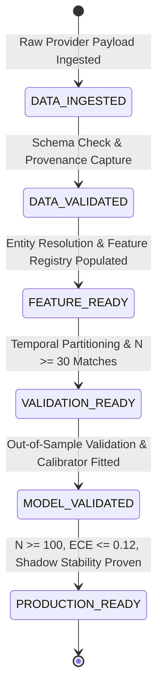

# Phase 11 — Model Promotion & Governance Policy

## 1. Overview & Policy Rationale

The Football Intelligence OS enforces an explicit, auditable **Model Promotion Policy**. No statistical model may be served to production decision surfaces, recruitment shortlists, or match scenario simulations without passing sequential, irreversible gates.

---

## 2. Canonical 6-Stage Competition Readiness Ladder (§6, §10)

Readiness transitions are strictly sequential. Skipping any stage raises an immediate `InvalidReadinessTransitionError`.



### Stage Transition Thresholds & Criteria

| From Stage | To Stage | Minimum Sample ($N$) | Required Evidence & Thresholds | Blockers |
|:---|:---|:---:|:---|:---|
| `[*] ` | `DATA_INGESTED` | $N \ge 1$ | Bronze snapshot persisted with SHA-256 digest | Ingestion network error, checksum mismatch |
| `DATA_INGESTED` | `DATA_VALIDATED` | $N \ge 10$ | `provenance_rate >= 0.995`, `missingness_rate <= 0.05` | Corrupt payloads, unvalidated schemas |
| `DATA_VALIDATED` | `FEATURE_READY` | $N \ge 20$ | `identity_resolution_rate >= 0.95`, `feature_coverage_rate >= 0.90` | Missing player mappings, deficient feature vectors |
| `FEATURE_READY` | `VALIDATION_READY` | $N \ge 30$ | Temporal chronological split verified without future leakage | $N < 30$, temporal leakage detected |
| `VALIDATION_READY` | `MODEL_VALIDATED` | $N \ge 50$ | Out-of-sample Brier score $\le 0.65$, Log Loss $\le 1.15$ | Underfitting, failure on validation partition |
| `MODEL_VALIDATED` | `PRODUCTION_READY` | $N \ge 100$ | ECE $\le 0.12$, Brier $\le 0.60$, Shadow stability $\ge 14$ days, PSI $< 0.20$ | Drift alert active, uncalibrated probabilities, $N < 100$ |

---

## 3. Model Lifecycle & Shadow Mode Execution (§18)

Models in the registry progress through eight explicit lifecycle states:
```
TRAINING ──> VALIDATION ──> SHADOW ──> CANDIDATE ──> PRODUCTION
                               │                       │
                               ▼                       ▼
                            RETIRED               DEGRADED
                                                       │
                                                       ▼
                                              RETRAIN_REQUIRED
```

### Shadow Candidate Isolation Guarantees
The `ShadowModeExecutor` (`app/phase11/shadow_mode.py`) runs candidate models alongside authoritative production models on live feeds:
1. **Zero Authoritative Impact**: Shadow predictions are logged into telemetry but NEVER exposed to user-facing scout shortlists, contract decisions, or match scenario simulations.
2. **Crash Resilience**: If a shadow model raises an unhandled exception during inference, the error is isolated and recorded in telemetry. The authoritative production engine continues execution without interruption.
3. **Dual Telemetry Capture**: Every dual inference records latency, absolute probability delta, prediction agreement, and input hashes for continuous statistical comparison.
4. **Promotion Recommendation**: A shadow model is eligible for `CANDIDATE` or `PRODUCTION` promotion only after achieving $\ge 90\%$ prediction agreement with baseline or demonstrating lower realized out-of-sample Brier score across $\ge 50$ evaluation instances.
