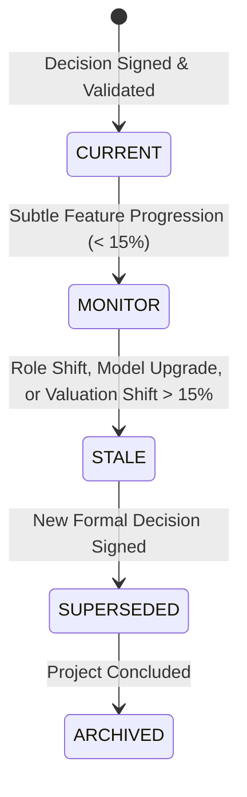

# Phase 12 — Decision Staleness & Retrospective Evaluation Feedback

## 1. Decision Freshness & Staleness Assessment (§4)

In the Football Intelligence OS, signed recruitment decisions (`DecisionRecord`) are strictly immutable once finalized. However, analytical conditions change as time elapses:
- Players transition tactical roles.
- Market valuations shift due to contract expiry proximity or peer transfers.
- Physical injuries alter availability profiles.
- Club formations or tactical managers change.
- New model versions are promoted to the Model Registry.

### Freshness States

### Staleness Trigger Rules
The `DecisionStalenessEngine` (`app/phase12/decision_staleness.py`) tags a historical decision as `STALE` when:
1. **Role Transition**: Player's primary tactical role profile shifts.
2. **Model Version Bump**: The authoritative production model updates.
3. **Valuation Shift**: Market valuation moves by $> €10\text{M}$ or $> 15\%$.
4. **Feature Progression**: Multiple core action features drift $> 15\%$.

---

## 2. Retrospective Decision Quality & Post-Transfer Evaluation (§16, §17)

Once a recruitment signing decision ages past 6 months, the system retrospectively evaluates realized performance against decision-time expectations:

### Alignment States
- **`ALIGNED`**: Realized minutes $\ge 80\%$ of expected volume and contribution percentile within $\pm 3.0$ points.
- **`PARTIALLY_ALIGNED`**: Realized minutes $\ge 50\%$ and contribution percentile within $-8.0$ points.
- **`DIVERGED`**: Realized minutes or performance fell materially below pre-transfer expectations.
- **`INSUFFICIENT_FOLLOWUP`**: Total competitive minutes $< 200$ (e.g. severe early injury).

### Epistemic & Temporal Safeguards:
1. **Non-Causal Policy**: We report *statistical alignment*, never causal success or blame (e.g. we do not claim "the transfer failed because the manager misused the player").
2. **Zero Temporal Leakage**: Post-decision match events are strictly prohibited from entering the training set of the historical model version that evaluated the decision.
