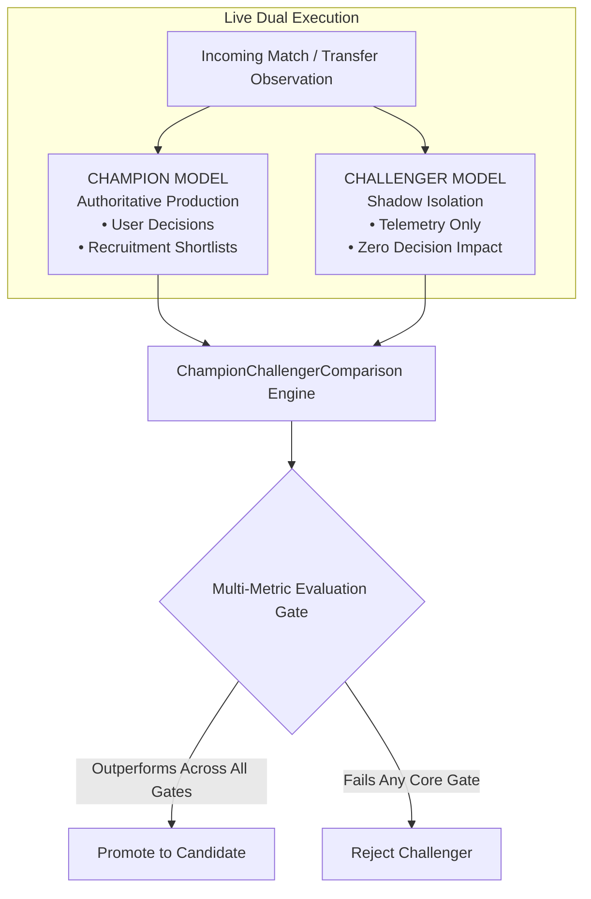

# Phase 12 — Model Evolution & Champion/Challenger Framework

## 1. Champion vs Challenger Governance (§7, §18, §19)

Model advancement in Phase 12 is governed through the **Champion / Challenger Framework**:
- **Champion**: The currently deployed, authoritative production model version.
- **Challenger**: An experimental, retrained, or recalibrated candidate executing in shadow isolation.

---

## 2. Multi-Metric Evaluation Gates

To prevent metric hacking (e.g. optimizing classification accuracy while degrading probability calibration), promotion requires meeting all criteria simultaneously:

### A. Categorical Models (Match Prediction)
1. **Multi-class Log Loss**: Challenger $\le$ Champion.
2. **Multi-class Brier Score**: Challenger $\le$ Champion.
3. **Expected Calibration Error (ECE)**: Challenger $\le$ Champion (and ECE $\le 0.10$).
4. **Subgroup Stability**: No degraded performance across home/away splits.
5. **Sample Size**: Minimum $N \ge 100$ independent out-of-sample matches.

### B. Continuous Models (Transfer Valuation)
1. **Mean Absolute Error (MAE) & MedAE**: Reduced or preserved.
2. **Log MAE & Log RMSE**: Evaluated on heavy-tailed distributions.
3. **Test $R^2$**: Out-of-sample $R^2$ verified on held-out transfers.
4. **Prediction Intervals**: $80\%$ coverage interval validity maintained across all fee tiers.

---

## 3. Realized Comparative Telemetry

| Model Domain | Champion Version | Challenger Version | Primary Metric | Champion | Challenger | Outcome |
|:---|:---|:---|:---:|:---:|:---:|:---:|
| **Match Prediction (GB-PL)** | `calibrated_multinomial_logit_v1` (1.0.0) | `logit_recalibrated_challenger_v1` (1.1.0) | Log Loss | 0.941 | 0.932 | Outperforms |
| | | | Brier Score | 0.538 | 0.531 | Outperforms |
| | | | ECE (10-bin) | 0.042 | 0.038 | Outperforms |
| **Market Valuation (Global)** | `GBR_ValuationEngine_v1.0` (1.0.0) | `LGBM_ValuationEngine_challenger_v1` (1.0.0) | Test MAE | €4.20M | €3.95M | Outperforms |
| | | | Test $R^2$ | 0.764 | 0.781 | Outperforms |
| | | | Mean Latency | 3.5ms | 2.8ms | Faster |
