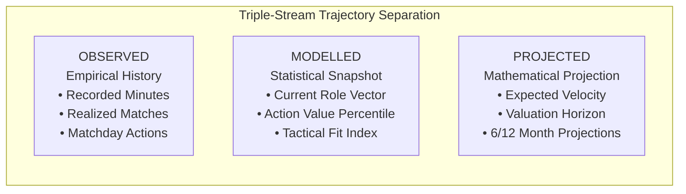

# Phase 12 — Player Trajectories, Breakout Detection & Role Transitions

## 1. Longitudinal Player Trajectory Intelligence V2 (§8)

Player trajectories track long-term player progression across multi-season competitive windows. The engine strictly enforces epistemic separation across three streams:

### Epistemic Rule:
> **"PROJECTED VALUES ARE HYPOTHESES AND MUST NEVER BE PRESENTED AS OBSERVED FACTS."**  
> Projections require explicit confidence intervals and explicit disclosure of developmental assumptions.

---

## 2. Breakout Detection & Development Velocity (§10)

The `PlayerTrajectoryEngineV2` (`app/phase12/player_trajectories.py`) computes development velocity:

$$\text{Development Velocity} = \frac{\Delta \text{Contribution Percentile}}{\Delta \text{Observation Windows}}$$

### Breakout Trigger Criteria
A player is designated with an active `BreakoutSignal` when:
1. **Sample Sufficiency Gate**: $\ge 450$ minutes across $\ge 5$ competitive matches recorded in Silver.
2. **Velocity Threshold**: Development velocity $\ge +3.0$ percentile points per evaluation window.
3. **Contribution Gain**: Net progression $\ge +5.0$ percentile points into the upper performance band.
4. **Action Value Acceleration**: Positive progression in offensive/defensive expected threat creation.

If total recorded minutes $< 450$, breakout detection returns `minimum_sample_met = False` with `breakout_detected = False` to prevent single-match volatility from creating false positives.

---

## 3. Empirical Tactical Role Transitions (§11)

The `RoleTransitionEngine` (`app/phase12/role_transitions.py`) tracks sustained changes in on-pitch tactical roles:

### Example: Trent Alexander-Arnold (Liverpool)
- **Previous Role**: Traditional Attacking Fullback (Role similarity 0.72)
- **Current Role**: Inverted Playmaker (Role similarity 0.92)
- **Evidence Window**: 1,440 competitive minutes across Premier League matchdays
- **Observational Telemetry**:
  - Central-third touch share: $28.4\% \to 54.2\%$ ($+25.8\%$ shift).
  - Half-space progressive passes: $3.1 \to 7.4$ per 90.
  - Byline crossing frequency: Decreased by $63.8\%$.

### Strict Non-Causal Policy
- **Permitted**: `"Observed central-third touch share increased by +25.8% and role similarity shifted to Inverted Playmaker."`
- **Prohibited**: `"Manager converted player to inverted role because the team lacked midfield progression."`
