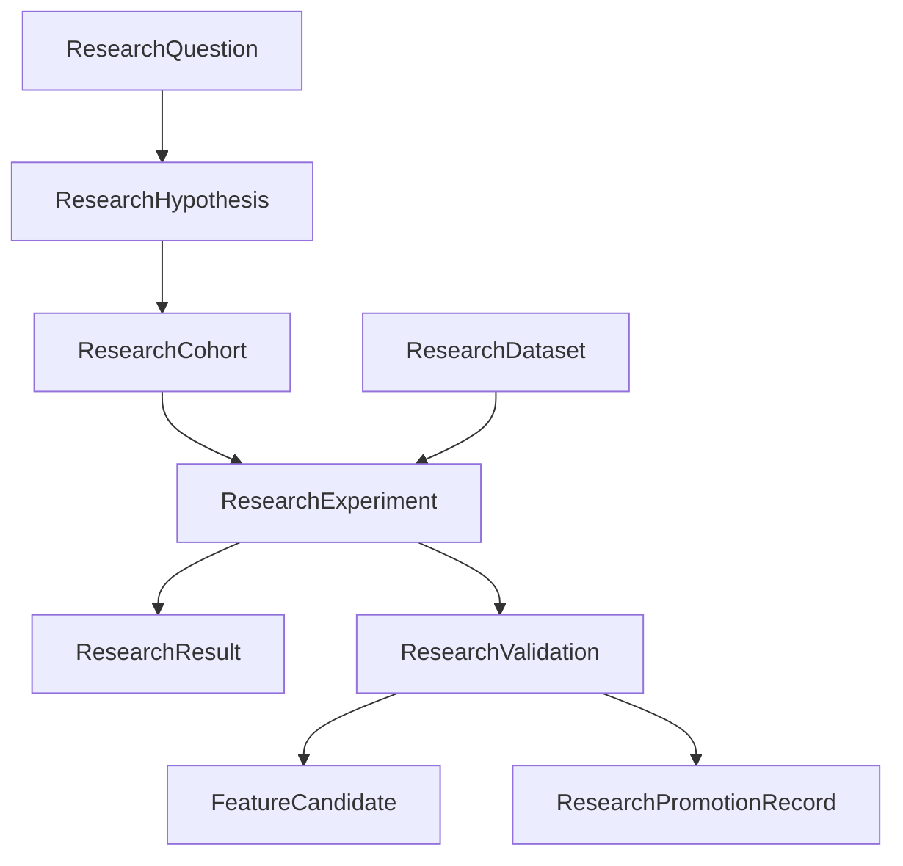

# PHASE 15 — GLOBAL RESEARCH ARCHITECTURE & EPISTEMIC GOVERNANCE
## Theoretical Foundations, Data Contracts, and Lifecycle Rules

**Certified State**: `OUTCOME_INTELLIGENCE_VALIDATED` (Phase 14 baseline)  
**Target State**: `ADAPTIVE_INTELLIGENCE_VALIDATED` (Phase 15 target)  
**Core Architectural Doctrine**:
1. **DISCOVERY $\ne$ VALIDATION $\ne$ PRODUCTION ADOPTION**: An observational pattern is an empirical hypothesis candidate, not a proven fact or production rule.
2. **STRICT EPISTEMIC MODALITY SEPARATION**: `OBSERVED`, `MODELLED`, `COUNTERFACTUAL`, `SCENARIO`, `ASSUMPTION`, `ANALYSIS`, `HYPOTHESIS`.
3. **MANDATORY NON-CAUSAL POLICY**: Direct causal claims ("signing player X caused result Y", "formation caused victory") are strictly prohibited in analytical traces, reports, and copilot responses.
4. **ZERO FABRICATION & SAMPLE SUFFICIENCY**: Missing fees are never coerced to zero; unknown distributions cannot be synthetically filled; minimum sample sizes ($N \ge 10$ or $N \ge 20$) are enforced.

---

### 1. Global Research Data Model

The Phase 15 research layer introduces 9 versioned entities registered under cryptographic hashing:



#### Entity Definitions:
- **`ResearchQuestion`**: Top-level analytical inquiry defining problem boundaries and scope.
- **`ResearchHypothesis`**: Testable empirical statement linking observed patterns to operational contexts. Explicitly non-causal.
- **`ResearchCohort`**: Reusable entity set (Players, Transfers, Teams, Matches). Immutably sealed upon use in completed experiments.
- **`ResearchDataset`**: Immutable snapshot with strict temporal cutoff ($T$).
- **`ResearchExperiment`**: Versioned testing execution linking cohort, dataset, methodology, and features with deterministic SHA-256 digest.
- **`ResearchResult`**: Descriptive effect estimate, confidence intervals, and disaggregated subgroup breakdowns.
- **`ResearchValidation`**: Independent holdout evaluation (Temporal holdout, Competition holdout, Negative controls, Leakage audit).
- **`FeatureCandidate`**: Candidate predictive feature identified through empirical discovery; requires stability audit.
- **`ResearchPromotionRecord`**: Governed champion vs challenger review ledger with mandatory human authorization.

---

### 2. The 8 Research Lifecycle States

```
DISCOVERED ──> HYPOTHESIS ──> TESTING ──> VALIDATED ──> PRODUCTION_CANDIDATE ──> PROMOTED
                                  │
                                  ├──> REJECTED
                                  │
                                  └──> INSUFFICIENT_EVIDENCE
```

1. **`DISCOVERED`**: Initial pattern candidate identified via observational scanning across 10 pattern families.
2. **`HYPOTHESIS`**: Formalized testable proposition with explicitly stated confounders and uncertainty bounds.
3. **`TESTING`**: Active evaluation across independent holdout cohorts.
4. **`VALIDATED`**: Replicated in out-of-sample data with statistical significance and passed leakage audits.
5. **`REJECTED`**: Failed replication, contradictory evidence, or temporal leakage detected.
6. **`INSUFFICIENT_EVIDENCE`**: Sample size below statistical reliability threshold ($N < 20$).
7. **`PRODUCTION_CANDIDATE`**: Model/feature ready for shadow mode evaluation against champion.
8. **`PROMOTED`**: Explicitly approved by governed human authority and promoted to active production pipeline.

---

### 3. Non-Causal Policy & Causality Guardrail

The Football Intelligence OS operates on observational match, tracking, and event data. Observational correlation must never be conflated with counterfactual causality:

| Prohibited Causal Formulation | Enforced Associative Phrasing |
| :--- | :--- |
| "Signing player X caused the team's victory." | "Signing player X coincided with positive team match outcomes." |
| "Adopting a 4-3-3 formation caused higher scoring." | "Adopting a 4-3-3 formation was associated with elevated offensive output." |
| "The transfer caused the player's development." | "The transfer was followed by an upward shift in observed performance." |
| "Tactical shift caused improved progression." | "Tactical shift aligned with increased progressive passing volume." |

The automated `CausalityGuardrail` scans inputs and reasoning outputs, rejecting violations in strict mode and sanitizing outputs deterministically.
