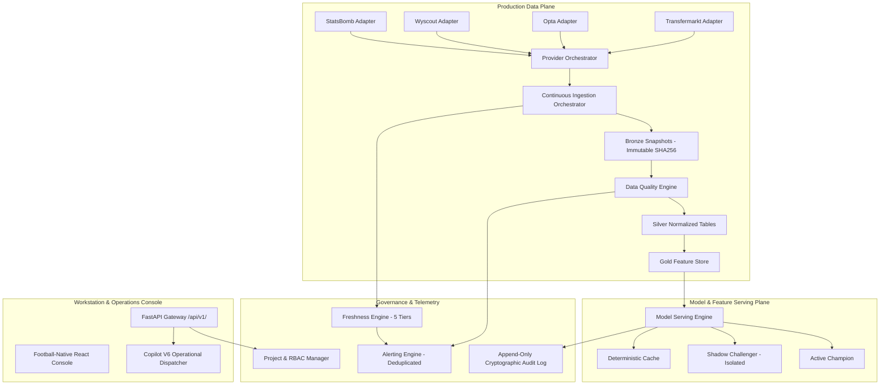

# Phase 16: Production Football Intelligence Platform Architecture

**Certified Baseline**: `PHASE_15: ADAPTIVE_INTELLIGENCE_VALIDATED`  
**Current Target**: `PHASE_16: PRODUCTION_FOOTBALL_INTELLIGENCE`  
**Architecture Date**: September 2026  

---

## 1. Executive Summary

Football Intelligence OS transitions in Phase 16 from an analytical research workstation into an end-to-end, resilient, observed, and governed production football intelligence platform. The architecture enforces strict epistemic isolation, temporal safety, cryptographic audit logging, continuous data quality gating, multi-provider failover, deterministic caching, and bounded background execution.

---

## 2. Architectural Tiers & Principles

### 2.1 Epistemic Separation
All analytical outputs preserve strict separation of epistemic categories:
- **OBSERVED**: Raw event/match records with cryptographic digests.
- **MODELLED**: Outputs generated by trained statistical models with 4-version metadata pinning.
- **COUNTERFACTUAL**: Scenario projections under specified tactical or market assumptions.
- **SCENARIO**: Alternative tactical setups without causal claims.
- **HYPOTHESIS**: Unvalidated or exploratory research ideas.

### 2.2 Core Architectural Planes
1. **Production Data Plane**: Provider rate-limiting (token bucket), health probes, controlled failover without silent overwrite, and SHA-256 content-addressed Bronze snapshots.
2. **Data Quality & Incident Management**: Strict validation gates (pitch bounds $x \in [0, 120]$, $y \in [0, 80]$, temporal bounds $t \in [0, 130]$ min, schema conformance), and incident tracking (`OPEN`, `INVESTIGATING`, `RESOLVED`).
3. **Freshness & Dependency Propagation**: 5-tier TTL tracking (Raw $\rightarrow$ Canonical $\rightarrow$ Feature $\rightarrow$ Model $\rightarrow$ Decision). Upstream staleness propagates deterministically to flag dependent decisions with `requires_review = True`.
4. **Model Serving & Shadow Operations**: Active champions execute with pinned model version, feature version, dataset version, and calculation version. Challengers execute in shadow mode with zero production side-effects.
5. **Security & Cryptographic Audit**: Append-only hash chain (`GENESIS_AUDIT_BLOCK` $\rightarrow$ $H_1 \rightarrow H_2 \dots$) with automatic secret redaction, and authoritative backend RBAC (`SCOUT`, `ANALYST`, `DECISION_MAKER`, `DATA_ENGINEER`, `ADMIN`, `VIEWER`).
